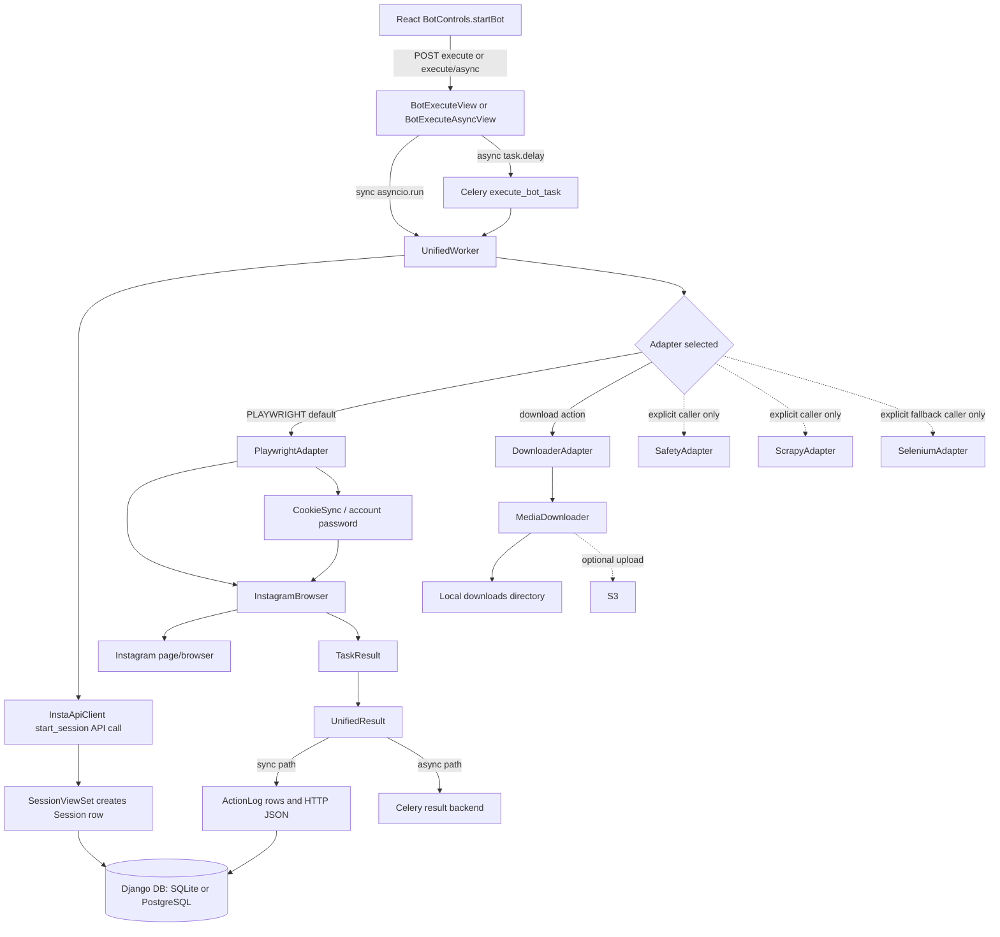
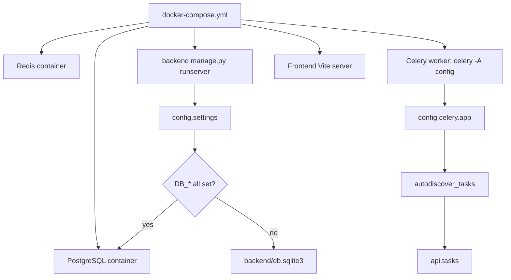
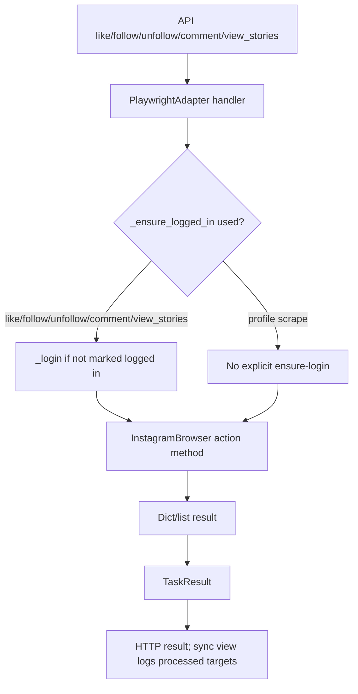
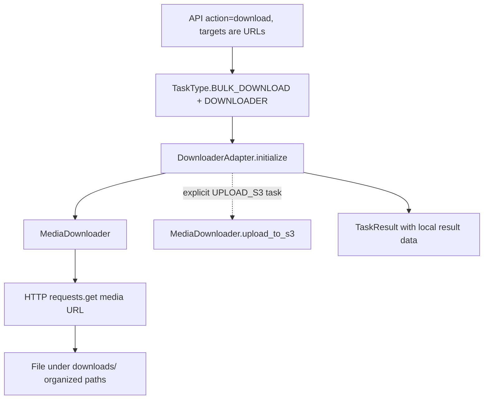
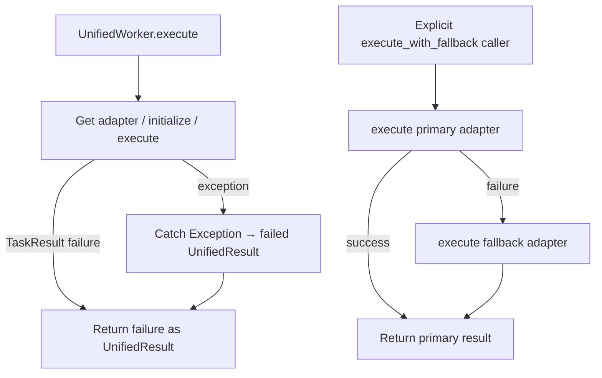

# Automation Architecture Map

> **Current execution contract:** This inventory began as a pre-refactor snapshot. The current implementation sends both `POST /api/v1/bot/execute/` and its legacy `/async/` alias through one asynchronous path. Django validates ownership, stores an `AutomationJob` in PostgreSQL, and publishes a Celery task; only the worker imports `orchestrator` and executes browser automation. Durable status and cancellation use `/api/v1/bot/jobs/{job_id}/` and `/cancel/`; the legacy task-status route resolves by Celery task ID. Playwright and browser binaries remain worker-only. Sections below that describe synchronous execution, direct imports from a request, `AsyncResult`-based status, or the old frontend polling behavior are historical and should not be treated as the current contract. See [docs/local_flow.md](./docs/local_flow.md) for the active flow.

## Scope and evidence rules

This map describes the files present in this repository and their imports/calls. “Connected” means a source-level call path exists; it does not mean a live Instagram run was executed or that third-party services are configured. No runtime tests were run for this inspection. Paths are repository-relative.

The repository has an `automation/` package and a separate `orchestrator/` package. There is no `automation/playwright/` or `automation/extractors/` directory despite several documents showing those paths; actual Playwright code is under `automation/playwright_engine/`.

## 1. Repository overview and entry points

| Component | Entry Point | File | Function/Class | Actually Used? |
| --- | --- | --- | --- | --- |
| Django HTTP server | `python manage.py runserver` / WSGI | `backend/manage.py`, `backend/config/wsgi.py` | `main()`, `application` | Yes as framework entry points; container backend command runs `manage.py runserver` |
| Django ASGI/WebSockets | ASGI server pointed at `config.asgi:application` | `backend/config/asgi.py` | `application` (`ProtocolTypeRouter`) | Defined; compose backend command uses Django `runserver`, not an explicit ASGI server command |
| REST API | `/api/v1/...` | `backend/config/urls.py`, `backend/api/urls.py` | Django URL patterns / APIView classes | Yes |
| Sync automation API | `POST /api/v1/bot/execute/` | `backend/api/bot_execute.py` | `BotExecuteView.post()` → `_execute_action()` → `_async_execute()` | Yes; this path invokes `UnifiedWorker` in the request process |
| Async automation API | `POST /api/v1/bot/execute/async/` | `backend/api/bot_execute.py`, `backend/api/tasks.py` | `BotExecuteAsyncView.post()` → `execute_bot_task()` | Yes as code path; actual processing requires a running Celery worker and broker |
| Orchestration library | Imported by both execute API modes | `orchestrator/unified_worker.py` | `UnifiedWorker` | Yes; central code called by both execute paths |
| Playwright browser | Constructed by adapter | `automation/playwright_engine/browser_manager.py` | `InstagramBrowser` | Yes through `PlaywrightAdapter`; some methods may be placeholders or UI-dependent |
| Celery app | `celery -A config worker` in root compose | `backend/config/celery.py` | `app = Celery('config')` | Yes configuration exists; task autodiscovery finds `api.tasks` if Django setup/apps import successfully |
| Celery beat | None configured | `backend/config/celery.py`, settings | No beat schedule | No schedule/beat task found |
| Frontend | Vite `index.html` → `src/main.jsx` | `frontend/index.html`, `frontend/src/main.jsx` | React `createRoot()` → `App` | Yes; root compose starts Vite |
| Frontend automation control | `/bot` route | `frontend/src/pages/BotControls.jsx` | `startBot()` | Yes; posts to sync/async execution APIs |
| Database initialization | Django migrations | `backend/manage.py`, app migration files | Django `migrate` command | Framework path exists; deployment script invokes `migrate`. No custom DB initialization function found |
| SQLite/PostgreSQL selection | Django settings | `backend/config/settings.py` | `DATABASES` conditional | Yes; Postgres only when all `DB_*` values are set, else SQLite |
| Scrapy CLI | `scrapy crawl ...` from project | `automation/scrapy_project/scrapy.cfg`, spider modules | Scrapy commands / spider classes | Intended standalone tool; no normal backend task points to it except the explicit orchestrator adapter route |
| Legacy worker CLI | `python orchestrator/bot_worker.py` | `orchestrator/bot_worker.py` | `main()` / `BotWorker` | Standalone script path exists; not called by Django or Celery task |
| Diagnostic scripts | `python check_db.py`, `python debug_init.py`, `python backend/seed_data.py` | Root/backend scripts | top-level functions | Standalone/manual; not normal automation flow |
| Node service | `node_service/src/index.js` | Node package | Express/server startup | Separate service; not called by Django automation execution |
| Spark jobs | Individual Python modules | `spark_jobs/` | job-specific modules | Separate data tooling; not in automation request path |

**Django configuration caveat:** `backend/config/settings.py` lists `'downloads'` in `INSTALLED_APPS`, and `backend/config/urls.py` includes `downloads.urls`; no `backend/downloads/` files appear in the repository inventory. `api/views.py` also imports `downloads.models`. This source-level missing package can prevent Django startup/import and means the API automation chain is structurally present but may be blocked before serving requests unless that app is supplied externally or the configuration is corrected. This map does not assume it exists.

## 2. Actual automation execution flow

### User/API path

The implemented automation path is initiated through the Bot Controls UI or by calling the API directly. The UI obtains account records from `/accounts/`, then `startBot()` posts action, `account_id`, and target strings to one of two endpoints.

#### Sync path

```text
BotControls.startBot()
  → POST /api/v1/bot/execute/
  → BotExecuteView.post()
  → BotExecuteView._execute_action()
  → BotExecuteView._async_execute() via asyncio.run()
  → UnifiedWorker.start_session()
  → UnifiedWorker.execute()
  → PlaywrightAdapter or DownloaderAdapter.initialize()/execute()
  → InstagramBrowser method or MediaDownloader method
  → TaskResult → UnifiedResult → HTTP JSON
  → ActionLog rows (for processed targets) on successful return path
```

| Step | File / class / method | Receives | Returns / side effect | Caller → next |
| --- | --- | --- | --- | --- |
| UI start | `frontend/src/pages/BotControls.jsx`, `startBot()` | selected account, action, comma-separated targets | Sends JSON; updates in-memory UI logs/alerts | User → API endpoint |
| Route | `backend/config/urls.py`, `backend/api/urls.py` | HTTP POST | Dispatches `/api/v1/bot/execute/` to `BotExecuteView` | Django router → view |
| Validate | `BotExecuteView.post()` | JSON validated by `BotExecuteSerializer` (`account_id`, action choice, string targets, options) | 400 on invalid data; retrieves `BotAccount`; rejects missing/non-active account | View → `_execute_action()` |
| Action map | `BotExecuteView._execute_action()` | account, action string, targets, options | Maps `like/follow/unfollow/scrape_profile/view_stories/download/comment` to `TaskType`; selects `PLAYWRIGHT`, except download → `DOWNLOADER` | `asyncio.run(self._async_execute(...))` |
| Worker/session setup | `BotExecuteView._async_execute()` and `UnifiedWorker.start_session()` | account ID | Creates worker; `InstaApiClient.start_session()` POSTs to backend session endpoint; on success stores `session_id` and creates `ActionCallback` | API view → `worker.execute()` |
| Adapter dispatch | `UnifiedWorker.execute()` | adapter type, task type, list of targets, options | Creates/caches adapter, calls its `initialize()`, checks task support, calls `adapter.execute()`; converts `TaskResult` to `UnifiedResult` | Worker → chosen adapter |
| Browser initialization | `PlaywrightAdapter.initialize()` | API client/account ID | Fetches account via backend API, derives proxy, constructs `InstagramBrowser(headless, proxy)` and starts it | Adapter → browser manager |
| Authentication | `PlaywrightAdapter._ensure_logged_in()` / `_login()` | account metadata and optional password in task options | Tries backend cookies via `CookieSync`; then decrypts/stores account password through Django ORM, logs in, validates session, and attempts to sync refreshed cookies | Action handler → `InstagramBrowser.login()` |
| Action / extraction | `PlaywrightAdapter` task handler | URL/usernames and options | Calls browser methods and returns `TaskResult`; profile handler gets `extract_profile_info`; scrape-posts currently returns `posts: []` after profile visit (comment says extraction method needed); action methods call like/follow/etc. | Adapter → `InstagramBrowser` |
| Download | `DownloaderAdapter` handler | URL(s), options | Calls `MediaDownloader` download/upload functions; results are adapter result dictionaries | Selected only when API action equals `download` |
| Result / callback | `UnifiedWorker.execute()` then `_async_execute()` | `TaskResult` | Result fields serialized into dict (`success`, count, errors, and `targets[:items_processed]`) | Back to `BotExecuteView.post()` |
| Persistence/logging | `BotExecuteView.post()` | result and targets | Creates `analytics.ActionLog` rows for a prefix of targets based on processed count; response contains status/count/errors | API response → UI |
| Cleanup/session stop | `_async_execute()` `finally` | worker | `worker.cleanup()` closes all cached adapters; `worker.stop_session()` calls `InstaApiClient.stop_session()` | Happens for sync path, including failures after setup |

`UnifiedWorker.start_session()` does not stop execution when its API call fails: it returns `False`, but the Django wrapper ignores that boolean and proceeds to `execute()`. The adapter still may initialize and run. `UnifiedWorker.get_adapter()` stores an adapter after initialization regardless of the returned boolean; adapter handlers then detect their own uninitialized state and return failure results.

The mapping for `download` is structurally inconsistent: `BotExecuteView` and Celery map it to `TaskType.BULK_DOWNLOAD` on `DownloaderAdapter`, but the React action selector shown in `BotControls.jsx` has no download option. It is still accepted by the API serializer. `DownloaderAdapter` needs URL/media inputs and does not extract URLs from browser scraping results.

#### Async path

```text
BotControls.startBot()
  → POST /api/v1/bot/execute/async/
  → BotExecuteAsyncView.post()
  → execute_bot_task.delay(...)
  → Redis broker → Celery worker
  → execute_bot_task() → asyncio.run(_run())
  → UnifiedWorker.start_session() → UnifiedWorker.execute()
  → adapter → result
  → Celery result backend → GET /api/v1/bot/task/<task_id>/
```

`backend/api/tasks.py::execute_bot_task` duplicates the action mapping and worker lifecycle. It does not write `ActionLog` rows (unlike the sync view), and this task has no explicit Celery retry policy or task state persistence in Django models. `TaskStatusView` reads Celery `AsyncResult`. In the frontend async mode, the client polls every two seconds for up to about four minutes. Root `docker-compose.yml` starts `celery -A config worker --loglevel=info` in the backend working directory, with Redis configured as broker/result backend.

There is a separate `backend/api/local_tasks.py` in-memory thread runner, but neither `BotExecuteAsyncView` nor `TaskStatusView` imports/calls it. It is not the active fallback when Celery is unavailable.

## 3. Master flow diagram



Dashed routes are not automatically used by the HTTP action mapping. No browser extraction-to-Django model storage call is present in the Playwright adapter.

## 4. Separate flow diagrams

### A. Startup flow



`config.asgi.application` also composes Django HTTP handling with Channels WebSockets and an in-memory channel layer. The compose backend command is `runserver`; no explicit Daphne command is shown. Root compose also starts Postgres/Redis/Node service/frontend, but no Selenium/Scrapy-specific process. Schema/migrations are invoked by `infrascripts/deploy/deploy_all.sh`, not automatically by the root compose backend command.

### B. Authentication/session flow

```mermaid
flowchart TD
  AD[PlaywrightAdapter.initialize] --> AC[InstaApiClient.get_account]
  AC --> REST[GET /api/v1/accounts/{id}/]
  AD --> WLOGIN[PlaywrightAdapter._login, when LOGIN task or protected action needs it]
  WLOGIN --> CS[CookieSync.load_from_backend]
  CS --> COOKIE[BotAccount.cookies_json via account API]
  COOKIE --> FILE[Export cookies to local cookie file]
  FILE --> BLOGIN[InstagramBrowser.login(cookie_path)]
  BLOGIN --> VALID[InstagramBrowser.is_session_valid]
  VALID -->|invalid or no cookies| PW[Password decrypt/optional set via Django ORM]
  PW --> BLOGIN2[InstagramBrowser.login(password, cookie_path)]
  VALID -->|valid| SAVE[Get fresh cookies → CookieSync.save_to_backend]
  BLOGIN2 --> SAVE
  SAVE --> DB[BotAccount.cookies_json via backend API]
```

Session tracking is distinct from browser authentication: `UnifiedWorker.start_session()` calls the backend session CRUD endpoint through `InstaApiClient`; it creates a database `Session` record. That record does not itself hold browser cookies. Actual cookie storage is in `BotAccount.cookies_json`; local cookie file paths are managed by `CookieSync`. Auth methods are invoked in `_login()` or lazily by selected authenticated Playwright handlers (`like`, `follow`, `unfollow`, `view_stories`, `comment`); profile scrape handler does not explicitly call `_ensure_logged_in()`.

### C. Scraping flow

```mermaid
flowchart TD
  REQUEST[API action=scrape_profile] --> UW[UnifiedWorker.execute PLAYWRIGHT/SCRAPE_PROFILE]
  UW --> PA[PlaywrightAdapter._scrape_profiles]
  PA --> BM[InstagramBrowser.extract_profile_info(username)]
  BM --> DICT[Profile dict or None]
  DICT --> RESULT[TaskResult.data.profiles]
  RESULT --> HTTP[HTTP response result count/errors]
  PA -. callback if configured .-> CALLBACK[ActionCallback.on_scrape_profile]
  CALLBACK -. backend API log call .-> LOG[ActionLog endpoint/model]
  SCR[ScrapyAdapter explicit invocation] --> SP[Scrapy spiders]
  SP --> ITEM[Scrapy Items]
  ITEM --> PIPE[MongoPipeline]
  PIPE --> MONGO[(MongoDB instagram_data)]
```

The normal API profile path uses Playwright and returns dictionaries in the response. It does not persist profile data to a Django profile model. The `ActionCallback` path may post logs through the API client, but `UnifiedWorker.start_session()` currently constructs it before adapters are initialized and passes it into adapter instances. Scrapy's separate Mongo pipeline persists Scrapy items when that spider/pipeline runs under configured Scrapy project settings. `ScrapyAdapter` collects items through its own custom collector runner, and its `_run_spider()` supplies `CrawlerRunner` settings that replace pipelines with `__main__.CollectorPipeline`; therefore Mongo persistence should not be inferred for this adapter route.

`PlaywrightAdapter._scrape_posts()` currently visits each profile then appends an empty posts list; it explicitly notes extraction would need implementation. Story viewing returns a count but does not return/store story objects in Django storage.

### D. Action flow



For each target, adapter handlers call browser methods. The main API does not execute a workflow that scrapes first and feeds extracted targets/posts into actions. `comment_text` is passed only through options, but Bot Controls request shown sends no options; hence UI-initiated comments reach handler with an empty string unless supplied by another API caller. Some handlers return success on attempted navigation/view with weak confirmation semantics; inspect the exact browser method for action-specific behavior.

### E. Safety flow

```mermaid
flowchart TD
  CALLER[Explicit caller invokes UnifiedWorker.execute_with_safety] --> GET[Get SafetyAdapter]
  GET --> CHECK[CHECK_RATE_LIMIT]
  CHECK -->|not allowed| STOP[Return Rate limit exceeded]
  CHECK -->|allowed| DELAY[GET_DELAY]
  DELAY --> LOOP[For each target: UnifiedWorker.execute(action, one target)]
  LOOP --> WAIT[asyncio.sleep(delay)]
  WAIT --> LOOP
```

This is opt-in. `BotExecuteView` and `execute_bot_task` call `UnifiedWorker.execute()`, not `execute_with_safety()`. `SafetyAdapter` initializes a `MemoryRateLimiter` (Redis limiter exists in package but is not selected by the adapter) and `DelayGenerator`; additional schedule and health handling are adapter methods, not automatic gates for Playwright actions. `SleepSchedule`, `AutoPause`, `SignalDetector`, `WarmupManager`, and `ActionLogger` are not automatically called in the core execution route. `execute_with_safety()` checks limiter and delay only and does not itself update health/pause state or record every action in the limiter before/after execution unless downstream method does so; inspect adapter method implementation for details.

### F. Downloader flow



No call from Playwright extraction to `DownloaderAdapter` exists. S3 is an explicit task/adapter method and depends on boto3/configuration; no automatic upload is shown. No Django `Download` model persistence call is visible in `DownloaderAdapter`. Bot Controls does not expose the `download` choice in the action select.

### G. Error/fallback flow



No Django/Celery code calls `execute_with_fallback()`. `SeleniumAdapter` supports only LOGIN and SCRAPE_PROFILE; the default fallback for other Playwright tasks therefore returns unsupported-task failure. There are duplicate Selenium trees (`automation/selenium/` and `automation/selenium_engine/`). The `SeleniumAdapter` imports `selenium_engine` symbols. The Selenium `fallback_handler.py` modules are not imported by `SeleniumAdapter` or `UnifiedWorker`; fallback is implemented at worker method level, not wired to those handler classes. `ScrapyAdapter._run_spider()` catches its own exceptions, logs them, and returns collected items (possibly empty), which can obscure an underlying crawler failure.

## 5. Orchestration analysis

**CENTRAL ORCHESTRATOR: FOUND — `orchestrator.unified_worker.UnifiedWorker`.** It creates and caches adapters, starts/stops the API-backed session, dispatches `TaskType` values, checks supported tasks, and wraps adapter results. It is genuinely called by both sync and Celery API execution paths.

It is not a full end-to-end workflow coordinator across every module:

| Question | Source-backed answer |
| --- | --- |
| Does a `BotController` exist? | No class named `BotController` is found. Django has `BotControlView`, a status/session CRUD control API, and the orchestrator class is `UnifiedWorker`. |
| Is the controller actually used? | `BotControlView` and bulk variant are routed; `start` creates `Session` records only. They do not enqueue or launch automation. The actual execution API is `BotExecuteView`/async counterpart. |
| Does Django directly call Playwright? | Django API views do not import Playwright directly. They import `UnifiedWorker`; `PlaywrightAdapter` imports and constructs `InstagramBrowser`. |
| Does Celery call Playwright? | The Celery task calls `UnifiedWorker`, which dispatches to `PlaywrightAdapter` for all mapped actions except download. |
| Is there a service layer? | No meaningful automation service layer lies between API and worker. `backend/services/` contains package initializers only in the file inventory; API execution imports orchestrator directly. |
| Are safety components automatically invoked before actions? | No. The HTTP and Celery flows call `execute()`. Safety is invoked only through explicit `execute_with_safety()` calls; no callsite in API/task code. |
| Are extractors automatically connected to storage? | Playwright profile extraction returns dicts through a result; no Django storage write is called by that handler. Scrapy pipeline can write Mongo during Scrapy runtime, but adapter runner replaces item pipelines with collector settings. |
| Is Downloader automatically triggered? | No chaining from browser/extractor to downloader. API action `download` explicitly selects it; then URL targets must be provided. S3 upload is another explicit adapter task. |
| Is Selenium fallback connected to Playwright? | `UnifiedWorker.execute_with_fallback()` can explicitly try a second adapter after any failure, but no production API/task call uses it. Dedicated fallback-handler modules are isolated. Selenium does not support most action types. |
| Is Scrapy part of normal runtime? | Not in the API's action map or default flow. It can be explicitly invoked through `UnifiedWorker` and the adapter; it also has standalone spiders/CLI configuration. |

**Closest orchestration layer:** `UnifiedWorker.execute()` is structurally central and the first relevant file to understand. The API maps a narrow set of actions and calls it; the worker does not coordinate scrape → safety → action → download → persistence as a single pipeline.

## 6. Dependency graph

Verified direct imports/calls (trimmed to automation execution dependencies):

```text
BotControls.jsx
└── frontend API client (Axios) → Django endpoints

BotExecuteView / execute_bot_task
└── UnifiedWorker
    ├── InstaApiClient
    │   └── Django account/session/action-log REST endpoints
    ├── ActionCallback
    │   └── InstaApiClient action-log methods
    └── AdapterType → adapter instance
        ├── PlaywrightAdapter
        │   ├── BaseAdapter / TaskType / TaskResult
        │   ├── InstagramBrowser (automation.playwright_engine.browser_manager)
        │   ├── CookieSync
        │   │   └── InstaApiClient
        │   └── Django BotAccount ORM + password encrypt/decrypt utility (login)
        ├── DownloaderAdapter
        │   └── MediaDownloader
        │       └── requests / optional boto3
        ├── SafetyAdapter
        │   ├── MemoryRateLimiter
        │   ├── DelayGenerator
        │   ├── HealthTracker / ActionLogger (as present in adapter methods)
        │   └── SleepSchedule (explicit schedule task)
        ├── ScrapyAdapter
        │   ├── Scrapy CrawlerRunner
        │   ├── HashtagSpider / ProfileSpider
        │   └── CollectorPipeline (local class in _run_spider)
        └── SeleniumAdapter
            ├── selenium_engine.DriverManager
            ├── selenium_engine.Navigation
            ├── selenium_engine.auth.SeleniumLogin
            └── selenium_engine.scraper.ProfileScraper
```

Separate/isolated connections include `automation/scrapy_project/.../pipelines/mongo_pipeline.py` through Scrapy's configured `ITEM_PIPELINES`, and `automation/playwright_engine/multi_account_manager.py` importing `InstagramBrowser`. The multi-account manager is not used by UnifiedWorker; workers are constructed for one account ID.

No Python circular dependency was established from the traced imports. There are architectural cycles in responsibility/data direction (orchestrator adapter → API client → Django API, and login adapter → Django ORM), but these are not module import cycles demonstrated by the source. Django app import failure due to absent `downloads` package is a missing dependency, not a circular import.

## 7. Module connection matrix

| Module | Exists | Imported By | Calls | Connected to Main Flow? | Status |
| --- | --- | --- | --- | --- | --- |
| Playwright | Yes (`automation/playwright_engine`) | `PlaywrightAdapter` | Browser lifecycle, auth, profile extraction, actions | Yes, default API adapter | CONNECTED |
| Safety | Yes (`automation/safety`) | `SafetyAdapter` | Rate limiter/delay and selected checks | Only explicit `execute_with_safety`; not API default | PARTIALLY CONNECTED |
| Downloader | Yes | `DownloaderAdapter` | URL download/local writes, explicit S3 upload | Explicit API `download` action maps here, but no scrape-to-download chain/UI selector | PARTIALLY CONNECTED |
| Scrapy | Yes | `ScrapyAdapter`, standalone CLI settings | Spiders; standalone Mongo pipeline configured | Optional explicit worker selection; not normal endpoint map; adapter runner custom collector | PARTIALLY CONNECTED |
| Selenium | Yes, duplicated `selenium` and `selenium_engine` trees | `SeleniumAdapter` imports `selenium_engine` | Login/profile scraping, explicit fallback worker call | No automatic fallback call; narrow tasks | PARTIALLY CONNECTED |
| Django | Yes | Server/API and automation API client | Routes, ORM models, session/account state | Main HTTP/API and persistence infrastructure | CONNECTED |
| Celery | Yes config/task | Async endpoint imports task; compose starts worker | Worker runs `UnifiedWorker` | Async branch when broker/worker are running | PARTIALLY CONNECTED |
| Redis | Compose/settings | Celery broker/result backend; optional Redis limiter class | Task queue/results; no adapter selection for Redis limiter | Connected to async infrastructure, not required by sync path | PARTIALLY CONNECTED |
| MongoDB | Scrapy pipeline and Node config/model code | Scrapy pipeline, Node service | Scrapy item upserts / Node persistence | Not connected to API Playwright flow; adapter runner bypasses configured Mongo pipeline | ISOLATED |
| PostgreSQL | Compose and Django settings | Django database conditional | Django ORM | Used when DB env values configured | CONNECTED |

`downloads` Django app referenced by settings/routes/imports is NOT FOUND as a source directory in this checkout; it is not the same thing as `automation/downloader`.

## 8. Entry points inventory

| Entry Point | File | Function | Purpose | Calls |
| --- | --- | --- | --- | --- |
| Django manage CLI | `backend/manage.py` | `main()` | Admin, migrate, runserver, other commands | Django command runner |
| WSGI deployment | `backend/config/wsgi.py` | module `application` | HTTP server callable | Django WSGI app |
| ASGI deployment | `backend/config/asgi.py` | module `application` | HTTP + WebSocket callable | Django ASGI + Channels router |
| REST automation sync | `backend/api/urls.py`, `backend/api/bot_execute.py` | `BotExecuteView.post()` | Run automation in request process | `UnifiedWorker` |
| REST automation async | same | `BotExecuteAsyncView.post()` | Queue task | `execute_bot_task.delay()` |
| Celery process | root `docker-compose.yml` | `celery -A config worker` | Background task worker | `backend/config/celery.py`, `api.tasks` |
| Celery task | `backend/api/tasks.py` | `execute_bot_task()` | Run async automation lifecycle in worker | `UnifiedWorker` |
| Celery task status | `backend/api/bot_execute.py` | `TaskStatusView.get()` | Return task status/result | Celery `AsyncResult` |
| Frontend Vite | `frontend/index.html`, `frontend/src/main.jsx` | React bootstrap | Load dashboard SPA | `App` |
| UI bot trigger | `frontend/src/pages/BotControls.jsx` | `startBot()` | Send sync/async execution request | Django execute endpoints |
| Scrapy CLI | `automation/scrapy_project/scrapy.cfg` | Scrapy command runner | Run a spider by name/arguments | Spider/settings/pipeline |
| Legacy worker script | `orchestrator/bot_worker.py` | `main()` | Demonstration/manual Playwright worker | `BotWorker` then browser operations |
| Seed script | `backend/seed_data.py` | `populate_test_data()` and main guard | Populate sample data | Django ORM models |
| Diagnostics | `check_db.py`, `debug_init.py`, `test_api.py` | top-level script bodies/main guards | Manual diagnostics | DB/API initialization checks |
| Playwright scripts | `test/playwright/test_*.py` | main guards and test functions | Manual browser exercises | `InstagramBrowser` |
| Downloader script tests | `automation/downloader/test_downloader.py` | unittest class/main guard | Downloader-local checks | `MediaDownloader` |
| Safety unit tests | `automation/safety/tests/test_rate_limiter.py` | unittest class/main guard | Memory limiter behavior | `MemoryRateLimiter` |
| Node server | `node_service/src/index.js` | module startup | Node HTTP/WebSocket service | Node DB and socket modules |
| Infra deploy | `infrascripts/deploy/deploy_all.sh` | shell script | Compose build/up and migrations | Container services, `manage.py migrate` |

**Structurally central entry point for automation:** `BotExecuteView.post()` / `BotExecuteAsyncView.post()` are the API entry points; for understanding the automation orchestration relationships, start with `orchestrator/unified_worker.py::UnifiedWorker.execute()`, because both API execution branches call it and it is the only source-level dispatcher across the adapters.

## 9. Data flow and state

### Important data movement

| Object | Input → Transformation → Output | Storage location / limitation |
| --- | --- | --- |
| Account | UI account ID → API serializer → `BotAccount` lookup → adapter fetches serialized account via `InstaApiClient` | Django ORM database; account status gates execute endpoint |
| Session | Worker account ID → `InstaApiClient.start_session()` → `SessionViewSet` create → session ID on worker/callback | Django `Session` row; control API start also creates a row without a worker |
| Cookies | BotAccount API JSON → `CookieSync` local file → `InstagramBrowser.login()` → fresh cookies → API update | `BotAccount.cookies_json` and local cookie file; actual browser context is in process memory |
| Profile | Username target → browser page → `extract_profile_info()` dictionary → `TaskResult.data.profiles` → `UnifiedResult` → HTTP response | No Django profile persistence in Playwright flow; action callback may separately log an action |
| Post | Profile target → Playwright visit → empty `posts` placeholder in Playwright adapter | No posts extracted/stored on this path; Scrapy can generate items on distinct route |
| Story | Username → browser `view_stories()` result → count in `TaskResult` | No story model/storage connection in this flow |
| Action | Action enum/string + targets → browser method → per-target success/error → task result | Sync path creates `ActionLog`; async task does not create logs in task body; callback API logging may exist depending on action method |
| Media | URL target → DownloaderAdapter → HTTP request/stream → local path; optional explicit upload | Local `downloads/` path; optional configured S3; no automatic Django `Download` row shown |
| Safety state | Calls into MemoryRateLimiter/DelayGenerator, etc. | In-memory per adapter/process unless the unused Redis limiter is explicitly instantiated; no persistent pause integration in execution route |
| Scrapy item | Spider response → item object → pipeline item mapping/upsert | Configured Mongo pipeline can write collections; `ScrapyAdapter._run_spider` installs collector pipeline instead |
| Task/job | Async API args → Celery message → task result | Redis broker/result backend; task state is not a Django job model |

### State table

| State | Stored Where | Owner | Read By | Updated By |
| --- | --- | --- | --- | --- |
| Browser | Process memory (`InstagramBrowser`, page/context) | `PlaywrightAdapter` instance | Adapter handlers | Adapter initialize/login/cleanup |
| Login/session cookies | `BotAccount.cookies_json`, local cookie file, browser context | `CookieSync` and browser login code | Playwright adapter/login | CookieSync save; account update endpoint |
| Account | Django database (`BotAccount`) | Django account app | APIs, adapters through API client, Playwright password path via ORM | Account ViewSet/API; operator/UI |
| Bot session | Django `Session` row + `UnifiedWorker.session_id` | API / worker | status endpoints/callback | `SessionViewSet`; worker start/stop API calls |
| Bot running indicator | React component state only | `BotControls` | UI render | `startBot()`/finally; stop handler only changes local state |
| Rate limit | `MemoryRateLimiter` instance state | `SafetyAdapter` | Safety task handlers | SafetyAdapter calls; not automatically invoked |
| Pause/risk | In-memory safety classes; account status DB only for manual pause | Safety package / Django | respective safety code or account API | No automatic risk-to-account update path found |
| Download | Local filesystem path; optional S3 object | `MediaDownloader` | adapter/result or operator | Downloader methods |
| Celery job | Broker/backend task state | Celery | TaskStatusView/UI poller | Celery worker |
| WebSocket group updates | Channels in-memory layer | `BotUpdatesConsumer` | connected clients | Requires an event sender; no sender from automation path was found |

`BotControls.stopBot()` only updates UI state and logs a message; it does not call a stop endpoint or revoke a Celery task. `BotControlView` stop/pause updates DB session/account state but does not signal a running browser worker.

## 10. Tests

| Test | File | Component | What It Verifies | Integration/E2E? |
| --- | --- | --- | --- | --- |
| Rate limiter unit suite | `automation/safety/tests/test_rate_limiter.py` | `MemoryRateLimiter` | Window limits, counters, resets/interface | Unit |
| Downloader unittest file | `automation/downloader/test_downloader.py` | `MediaDownloader` | Local downloader methods using test code/temp data | Component/unit; not end-to-end automation |
| Playwright browser scripts | `test/playwright/test_*.py` | Browser manager methods: session, profile/post/story extraction, actions, screenshots, explore, multi-account | Manual browser integration exercises; named test files are script-style and have `__main__` blocks; no Django→Celery→automation E2E assertion suite found |
| Backend analytics tests | `backend/analytics/tests.py` | Analytics API/models | Inspect file for individual assertions; not automation execution path | Django app tests, not automation E2E |
| Account tests | `backend/account/tests.py` | Account app | Account API/model behavior; no orchestrator flow test identified from the inventory | Django app tests, not automation E2E |
| Root API script | `test_api.py` | Manual API request | Script diagnostic, not a comprehensive test suite | Manual/integration smoke at most |

Missing tests to prove the end-to-end flow (not written): API serializer/status gate and action map; session creation and cleanup; sync execution with adapter injection; Celery enqueue/worker/result round-trip; cookie import/login persistence; action log correctness for partial failures; safety enforcement before each target; scrape result persistence; download chaining and model/S3 state; fallback only for supported tasks; stop/pause cancellation semantics; startup checks covering installed apps and URL imports.

## 11. Dead / isolated / placeholder code

| Component | File | Evidence | Why it appears isolated / status |
| --- | --- | --- | --- |
| `BotControlView` start action | `backend/api/views.py` | Creates active `Session`; no call to task/orchestrator | Session toggle, not automation launch |
| `local_tasks` runner | `backend/api/local_tasks.py` | Search finds no import/call from API endpoints | Proposed Celery fallback not wired |
| `BotWorker` legacy worker | `orchestrator/bot_worker.py` | Main guard provides standalone demo; no production callers found | Parallel worker implementation, separate from `UnifiedWorker` flow |
| Dedicated Selenium fallback handlers | `automation/selenium_engine/fallback_handler.py`, `automation/selenium/fallback_handler.py` | No imports/calls from unified worker or SeleniumAdapter | Duplicate isolated fallback utilities |
| Duplicate Selenium package | `automation/selenium/` and `automation/selenium_engine/` | Same named concepts, adapter imports only `_engine` modules | Parallel implementations; adapter targets the `_engine` package |
| Multi-account browser manager | `automation/playwright_engine/multi_account_manager.py` | Uses `InstagramBrowser`; no reference from UnifiedWorker/API | Independent manager, not used for API-selected one-account worker |
| Safety orchestration helpers | `automation/safety/behavior/*`, `risk/*`, logging | Package exports/helpers, but no call from normal API task path | Implemented utilities, mostly opt-in/isolated; safety adapter is explicit |
| Redis rate limiter | `automation/safety/rate_limiter/redis_limiter.py` | Exported but SafetyAdapter initializes `MemoryRateLimiter` | Exists but not selected by adapter default |
| Mongo pipeline | `automation/scrapy_project/.../pipelines/mongo_pipeline.py` | Enabled in Scrapy settings; adapter's `_run_spider()` overrides ITEM_PIPELINES with collector | Available for standalone Scrapy project, not adapter collected result path |
| Followers Scrapy handler | `orchestrator/adapters/scrapy_adapter.py` | `_scrape_followers()` returns “FollowersSpider not implemented yet” | Placeholder despite spider class existing |
| Playwright post scraping | `orchestrator/adapters/playwright_adapter.py::_scrape_posts` | Visits profile then appends `{"posts": []}`; comment says extraction needed | Placeholder implementation |
| Download flow from scraper | `orchestrator/adapters/playwright_adapter.py`, `downloader_adapter.py` | No calls/URL handoff between them | Separate tasks, not pipeline |
| Missing Django downloads app | `backend/config/settings.py`, `backend/config/urls.py`, `backend/api/views.py` references | `backend/downloads/` absent in repository file inventory | Runtime package dependency is missing in this checkout |
| Schedule endpoint | `backend/api/views.py::UpcomingScheduleView` | Returns `{'items': []}` and comments says later Celery beat/model | Placeholder API; no beat schedule found |
| WebSocket updates | `backend/api/consumers.py` | Receives group event, but no `group_send` producer found in bot execution code | UI channel exists; automation doesn't publish these updates |
| Download reporting UI/backend | Frontend pages and `downloads` imports | Download backend app missing; BotControls no download option | Documentation/UI features cannot be confirmed connected to downloader |
| Exports | `backend/api/views.py` | Directly creates local files and DB job synchronously | Implemented separate dashboard feature, not automation flow |

## 12. Documentation vs reality

Files compared include root `README.md` (not present; root has `FULL_README.md` and `README_INTERVIEW.md`), `docs/automation_roadmap.md`, `docs/implementation_summary.md`, `docs/automation_module_overview.md`, `docs/orchestrator_integration.md`, `docs/local_flow.md`, and implementation source.

| Feature | Documentation Says | Source Code Shows | Difference |
| --- | --- | --- | --- |
| Roadmap overall completion | Automation roadmap marks Playwright (22), downloader (12), safety (12), Scrapy (8) tasks done | `PlaywrightAdapter._scrape_posts()` is a placeholder; Scrapy followers handler says not implemented; adapters are not globally orchestrated | “Done” often means files/classes exist, not verified integration/completion |
| Selenium fallback | Implementation summary says automatic fallback from Playwright; orchestrator doc describes automatic fallback | Worker exposes explicit `execute_with_fallback`, but Django/Celery do not call it; fallback handler classes isolated; Selenium only supports login/profile | Not automatic in normal runtime |
| Safety | Docs present a before-action gate and complete safety module | API/Celery call `execute()` directly, not `execute_with_safety`; risk/pause/sleep/warmup are not global gates | Utilities exist without default action interception |
| Scrapy → MongoDB | Docs describe a configured Mongo storage pipeline | Standalone project settings enable it; adapter `_run_spider()` replaces pipelines with in-memory collector | Mongo storage is not the adapter's normal collection destination |
| Extractor → storage | Overview/roadmap implies extractors and storage | Playwright profile handler returns result dictionaries; no profile model persistence call | Returned to caller, not stored as extracted domain records |
| Downloader → Playwright | Roadmap says downloader connected to Playwright scraper | Downloader adapter is separate; no adapter call from scrape handlers; API needs explicit URL target and action | No automatic download after scraping |
| Frontend → backend → Celery | `docs/local_flow.md` describes sync and async execution | This is materially supported by source: BotControls calls routes and async endpoint uses Celery task | Caveats: root compose task naming/workdir should be checked; missing `downloads` app can block Django startup; async task does not write same ActionLog rows |
| Bot start/control | Dashboard docs call these bot controls | `/bots/control/` only mutates session/account rows; actual launch uses `/bot/execute[/async]/` | “Start bot” meanings differ by endpoint |
| Scheduling | Docs refer to schedules/beat as planned/available | `UpcomingScheduleView` returns empty list; no `beat_schedule` defined | No implemented schedule execution path found |
| Real-time progress | Orchestrator docs describe callback/WebSocket broadcasts | Consumer can send received channel events; no automation execution publisher found | No connected live automation WebSocket progress path established |
| Backend database | docs say Postgres in Docker, SQLite local | Settings conditionally select DB based on all four `DB_*` values; compose provides Postgres values | Accurate conditional, not universally Postgres |
| Repository structure | Docs show `automation/extractors`, `automation/playwright`, plus broad service paths | Actual repo uses `playwright_engine`; there is no extractors dir; services packages largely empty | Written tree is aspirational/stale |
| Test coverage | Summary says verification commands were run; roadmaps mark features done | Existing tests are mostly safety unit test, downloader component test, script-style Playwright exercises, plus app tests; no flow integration suite | Unit/manual checks do not prove API-to-worker-to-storage wiring |
| Documentation root README | Prompt refers to README | Root has `FULL_README.md`, `README_INTERVIEW.md`, `docs/README.md`; no root `README.md` in inventory | Identify actual docs by file name rather than assumed README |

## 13. WHERE SHOULD I START?

### 1. What is the current actual automation entry point?

`POST /api/v1/bot/execute/` for synchronous execution, or `POST /api/v1/bot/execute/async/` followed by Celery worker execution. The React Bot Controls page calls these routes. `/api/v1/bots/control/` does not launch automation.

### 2. What is the first file I should open?

`backend/api/bot_execute.py` to understand request validation, action mapping, and the sync/async split. Then open `orchestrator/unified_worker.py` for the actual adapter dispatcher.

### 3. What is the first function/class I should understand?

`BotExecuteView.post()` for the user request boundary, followed by `UnifiedWorker.execute()` for the central dispatch. For background processing, also read `execute_bot_task()`.

### 4. What calls it?

The frontend `BotControls.startBot()` posts the request. Django URL patterns route the endpoint to the view. `BotExecuteView._async_execute()` creates the worker and calls `start_session()` then `execute()`; Celery task `_run()` does the equivalent for async work.

### 5. What does it call next?

`UnifiedWorker.execute()` gets/creates an adapter (`PlaywrightAdapter` for ordinary actions, `DownloaderAdapter` for `download`), then invokes its `execute()`. Playwright actions call methods on `InstagramBrowser`.

### 6. What is the first missing connection in the automation flow?

The largest safety gap at the dispatch boundary: both production execution paths bypass `UnifiedWorker.execute_with_safety()`, so the existing rate/delay/sleep/risk components do not automatically gate ordinary actions. Separately, extracted data has no connected domain storage, and download is not chained to extraction. For “flow can start” specifically, check the missing `downloads` Django package reference, which can block Django boot before the API entry point is reached.

### 7. What should be implemented FIRST to make the automation flow work end-to-end?

First make the supported execution contract coherent at `UnifiedWorker`/task boundary: ensure an API request can start a session, run a supported adapter task with safety checks, persist the task/action outcome, and cleanly stop it, with an integration test proving that complete sequence. Before modifying that path, resolve the absent `downloads` app dependency so Django can load its configured apps and URLs. This is an implementation target recommendation derived from the source gaps; no code is provided here.

## 14. FINAL EXECUTION MAP

```text
CURRENT SYSTEM

ENTRY
  ↓
React BotControls → Django BotExecuteView (sync) OR BotExecuteAsyncView
  ↓
UnifiedWorker (Celery task invokes same worker for async route)
  ↓
PlaywrightAdapter (ordinary action) OR DownloaderAdapter (explicit download action)
  ↓
PLAYWRIGHT: InstagramBrowser → Instagram browser/session methods
  ↓
Result dictionaries / TaskResult → sync ActionLog + response, or Celery result backend
  ↓
STORAGE: Django DB for account/session/action log; media local filesystem/optional S3;
         Scrapy standalone pipeline can use MongoDB
```

**CONNECTED COMPONENTS:** React Bot Controls → execute endpoints; execute endpoints → `UnifiedWorker`; Celery task → worker; worker → selected adapters; Playwright adapter → Playwright browser manager; account/session API → Django models; sync endpoint → ActionLog.

**ISOLATED COMPONENTS:** legacy `BotWorker`; dedicated Selenium fallback classes; multi-account manager; most safety helpers in normal execution; standalone Scrapy Mongo pipeline from adapter collector route; Node/Mongo and Spark tools; local in-memory task runner.

**MISSING CONNECTIONS:** absent Django `downloads` app referenced by settings/routes/imports; API start/stop controls do not launch/cancel a worker; no automatic safety wrapper; no scrape-to-download pipeline; no Playwright extracted-profile/post/story storage; no automatic Selenium fallback; async task lacks the sync path's ActionLog writes; no Celery beat schedule or automation WebSocket publisher.

**FIRST IMPLEMENTATION TARGET:** confirm Django can load by supplying/removing the missing `downloads` dependency, then connect the actual execution boundary (`BotExecuteView`/`execute_bot_task` → `UnifiedWorker`) to a tested, safety-gated task lifecycle with persisted outcomes. No application code was changed during this inspection.
