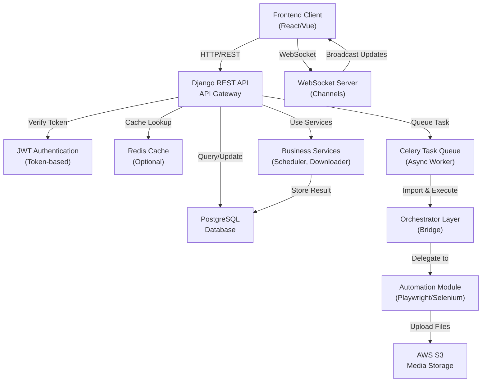
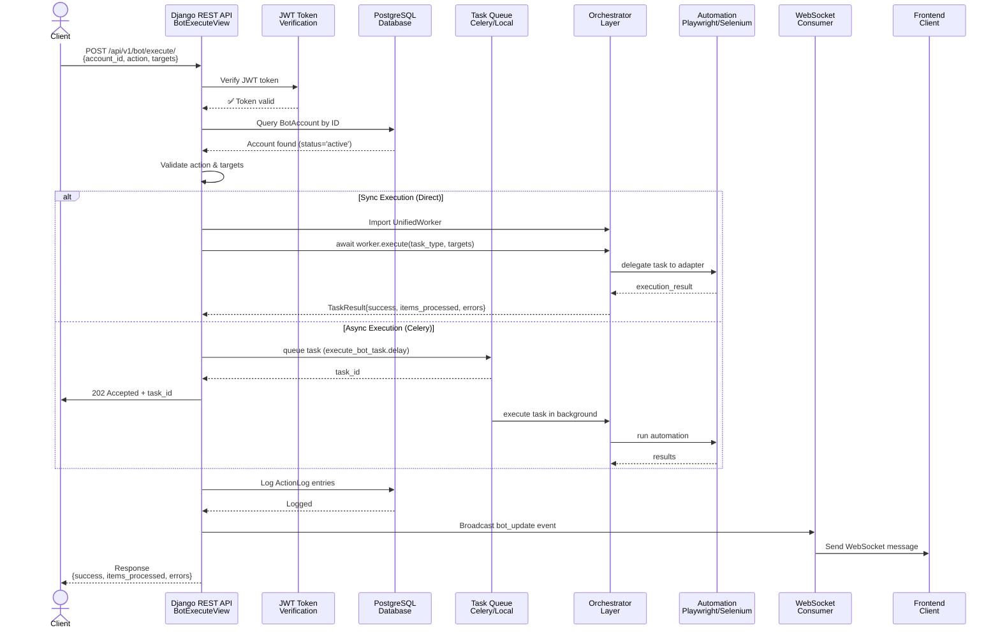
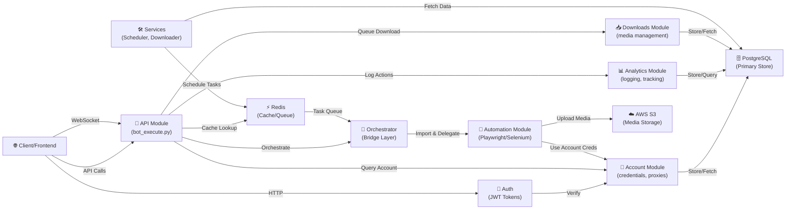
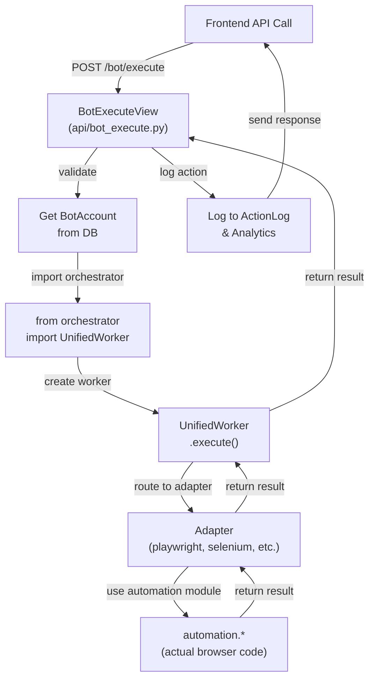
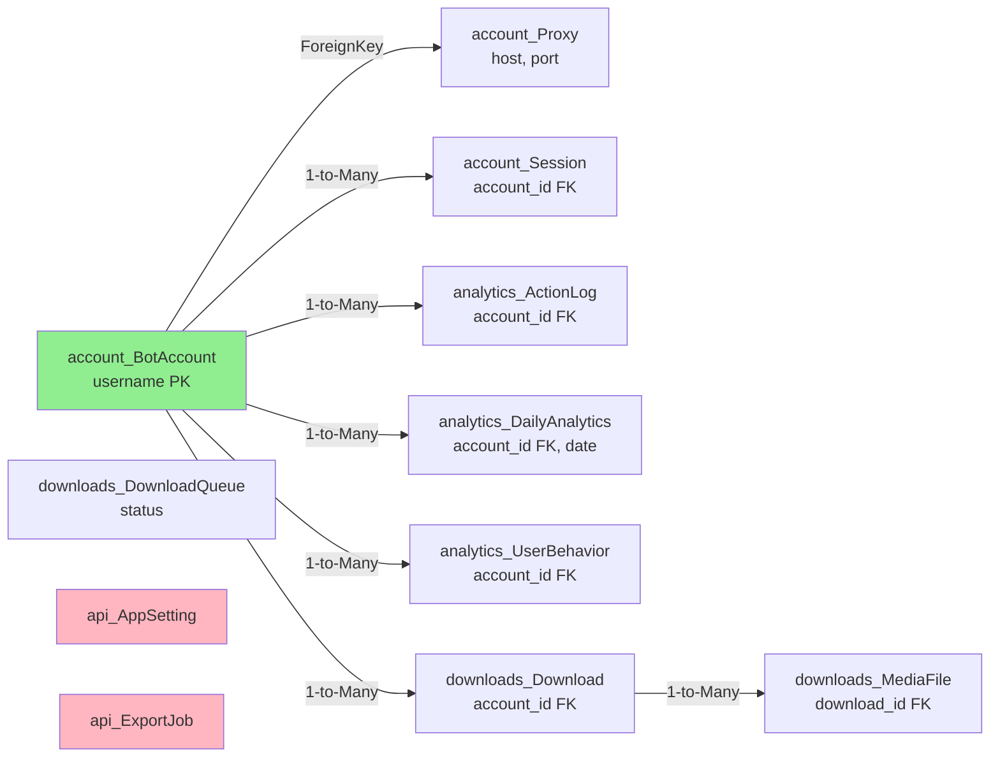
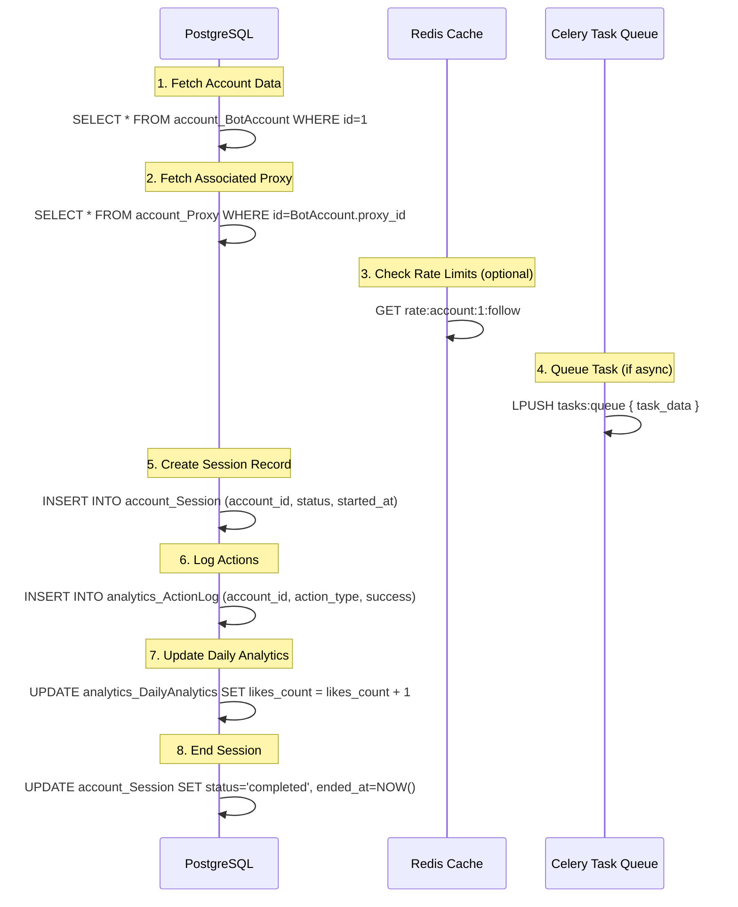
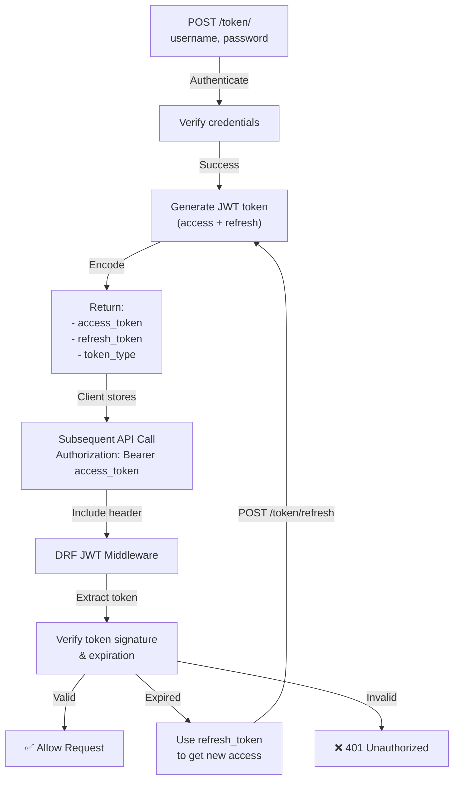
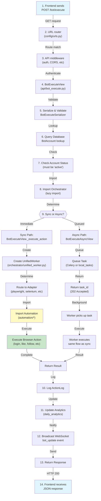

# InstaBot Backend Architecture Documentation

**Version:** 1.0  
**Date:** May 29, 2026  
**Framework:** Django 4.2 + Django REST Framework + Channels

---

## Table of Contents

1. [Complete Backend Architecture Overview](#1-complete-backend-architecture-overview)
2. [Folder Structure & Module Purpose](#2-folder-structure--module-purpose)
3. [API Flow & Request/Response Lifecycle](#3-api-flow--requestresponse-lifecycle)
4. [Service-to-Service Connections](#4-service-to-service-connections)
5. [Automation Module Integration](#5-automation-module-integration)
6. [Class & Method Dependencies](#6-class--method-dependencies)
7. [Database Connection Flow](#7-database-connection-flow)
8. [Authentication & Authorization](#8-authentication--authorization)
9. [External Integrations](#9-external-integrations)
10. [Entry Points & Execution Flow](#10-entry-points--execution-flow)
11. [Important Classes & Methods (Production)](#11-important-classes--methods-production)
12. [Unused Code & Cleanup Recommendations](#12-unused-code--cleanup-recommendations)

---

## 1. Complete Backend Architecture Overview

### High-Level System Architecture



### Core Modules

| Module | Purpose | Status |
|--------|---------|--------|
| **account** | Bot account & proxy management | ✅ Active |
| **analytics** | Action logging & performance metrics | ✅ Active |
| **api** | Core API endpoints & bot execution | ✅ Active |
| **downloads** | Media download queue & management | ✅ Active |
| **config** | Django settings & URL routing | ✅ Active |
| **core** | Exception handling & utilities | ✅ Active |
| **services** | Business logic (scheduler, downloader, instagram) | ⚠️ Stub Only |
| **api/v1** | Deprecated API v1 structure | ❌ Unused |

---

## 2. Folder Structure & Module Purpose

```
backend/
├── config/                      # Django project configuration
│   ├── settings.py             # Database, apps, middleware setup
│   ├── urls.py                 # Root URL routing (main router)
│   ├── asgi.py                 # WebSocket & async support (Channels)
│   ├── wsgi.py                 # WSGI app entry point
│   └── celery.py               # Celery task queue configuration
│
├── account/                     # Bot Account Management Module
│   ├── models.py               # Proxy, BotAccount, Session models
│   ├── views.py                # ProxyViewSet, BotAccountViewSet, SessionViewSet
│   ├── serializers.py          # Request/response serializers
│   ├── urls.py                 # Account-related endpoints
│   ├── utils.py                # Password encryption/decryption helpers
│   ├── admin.py                # Django admin interface setup
│   └── migrations/             # Database migrations
│
├── api/                         # Core API & Bot Execution Module
│   ├── bot_execute.py          # ⭐ CRITICAL: Bot execution entry point
│   ├── views.py                # BotStatus, BotControl, Export, Health views
│   ├── models.py               # AppSetting, ExportJob models
│   ├── tasks.py                # Celery async task for bot execution
│   ├── consumers.py            # WebSocket consumer for bot updates
│   ├── urls.py                 # ⭐ Main API routes (all endpoints defined here)
│   ├── local_tasks.py          # Local task queue (fallback if Celery unavailable)
│   ├── routing.py              # WebSocket routing (Channels)
│   └── migrations/             # Database migrations
│
├── analytics/                   # Analytics & Action Logging Module
│   ├── models.py               # DailyAnalytics, ActionLog, UserBehavior
│   ├── views.py                # DailyAnalyticsViewSet, ActionLogViewSet
│   ├── serializers.py          # Serializers for analytics data
│   ├── urls.py                 # Analytics endpoints
│   └── migrations/             # Database migrations
│
├── downloads/                   # Media Download Management Module
│   ├── models.py               # Download, MediaFile, DownloadQueue models
│   ├── views.py                # DownloadViewSet, DownloadQueueViewSet
│   ├── serializers.py          # Download serializers
│   ├── urls.py                 # Download endpoints
│   ├── tasks.py                # Download task processing
│   └── migrations/             # Database migrations
│
├── services/                    # Business Service Layer (STUB)
│   ├── downloader/             # Media downloader service (EMPTY)
│   │   └── __init__.py
│   ├── instagram/              # Instagram-specific service (EMPTY)
│   │   └── __init__.py
│   ├── scheduler/              # Task scheduler service (EMPTY)
│   │   └── __init__.py
│   └── __init__.py
│
├── core/                        # Core Utilities
│   ├── exceptions.py           # Custom exception handler
│   ├── auth/                   # Auth utilities
│   └── permissions/            # DRF permission classes
│
├── cookies/                     # Cookie storage (empty placeholder)
│
├── api/v1/                      # ❌ DEPRECATED - Old API v1 (unused)
│   └── accounts/               # Duplicate old models (should be removed)
│
├── db.sqlite3                   # Local SQLite database (dev only)
├── manage.py                    # Django CLI entry point
├── seed_data.py                # Database seeding script
└── README.md                    # Basic API guide
```

### Module Responsibilities

#### `account/`
- **Manages:** Bot credentials, proxies, session tracking
- **Key Models:** `Proxy`, `BotAccount`, `Session`
- **Key Views:** Account CRUD, proxy management, session lifecycle
- **Security:** Password encryption/decryption via `utils.py`

#### `api/` (CORE)
- **Manages:** Bot execution, system status, exports
- **Key Entry Point:** `bot_execute.py` → `BotExecuteView` (sync) / `BotExecuteAsyncView` (async via Celery)
- **Real-time Updates:** `consumers.py` for WebSocket connections
- **Task Processing:** Synchronous and asynchronous execution paths
- **Models:** `AppSetting`, `ExportJob`

#### `analytics/`
- **Tracks:** Daily action counts, individual action logs, user behavior patterns
- **Real-time Data:** Aggregates bot activity into `DailyAnalytics`
- **Audit Trail:** `ActionLog` records every bot action with success/error status

#### `downloads/`
- **Queue Management:** Tracks pending downloads with priority levels
- **Status Tracking:** Download progress, file metadata, S3 upload status
- **Storage:** Local `Download` records reference S3 keys and local paths

#### `services/` (PLACEHOLDER)
- Currently empty stubs - intended for business logic
- Downloader service could encapsulate media download logic
- Instagram service could contain Instagram-specific API interactions
- Scheduler could handle task scheduling and cron-like behavior

#### `config/`
- **Settings:** Database config (PostgreSQL/SQLite), installed apps, middleware
- **Routing:** Main URL dispatcher (`urls.py`), WebSocket routing (`routing.py`)
- **Async:** Channels configuration for WebSocket support

---

## 3. API Flow & Request/Response Lifecycle

### Complete Request/Response Flow Diagram



### API Endpoints Summary

#### **Authentication**
```
POST   /api/v1/token/              # JWT token obtain (login)
POST   /api/v1/token/refresh/      # Refresh token
POST   /api/v1/token/verify/       # Verify token validity
```

#### **Account Management**
```
GET    /api/v1/accounts/                    # List all bot accounts
POST   /api/v1/accounts/                    # Create new account
GET    /api/v1/accounts/{id}/               # Get account details
PUT    /api/v1/accounts/{id}/               # Update account
DELETE /api/v1/accounts/{id}/               # Delete account
GET    /api/v1/accounts/{id}/health/        # Account health check
POST   /api/v1/accounts/{id}/update_cookies # Update session cookies

GET    /api/v1/proxies/                     # List proxies
POST   /api/v1/proxies/                     # Create proxy
GET    /api/v1/proxies/{id}/                # Get proxy
PUT    /api/v1/proxies/{id}/                # Update proxy
DELETE /api/v1/proxies/{id}/                # Delete proxy

GET    /api/v1/sessions/                    # List sessions
GET    /api/v1/sessions/{id}/               # Get session details
POST   /api/v1/sessions/{id}/end/           # End session
```

#### **Bot Control & Execution** (⭐ PRIMARY)
```
POST   /api/v1/bot/execute/              # Sync bot execution (blocks until done)
POST   /api/v1/bot/execute/async/        # Async bot execution (returns task_id)
GET    /api/v1/bot/task/{task_id}/       # Check async task status

GET    /api/v1/bots/status/              # Get all bot status
POST   /api/v1/bots/control/             # Start/stop/pause single bot
POST   /api/v1/bots/control/bulk/        # Start/stop/pause multiple bots
```

#### **Analytics & Monitoring**
```
GET    /api/v1/analytics/                           # Daily analytics list/filter
GET    /api/v1/analytics/dashboard/                 # Dashboard summary
GET    /api/v1/analytics/accounts/{id}/stats/       # Per-account stats

GET    /api/v1/analytics/actions/                   # Action log (all)
POST   /api/v1/analytics/actions/                   # Log new action
GET    /api/v1/analytics/actions/{id}/              # Get action detail

GET    /api/v1/analytics/behavior/                  # User behavior data
```

#### **Downloads**
```
GET    /api/v1/downloads/                          # List downloads
POST   /api/v1/downloads/                          # Create download
GET    /api/v1/downloads/{id}/                     # Get download
POST   /api/v1/downloads/{id}/status/              # Get detailed status

GET    /api/v1/queue/                              # List download queue
POST   /api/v1/queue/                              # Add to queue
POST   /api/v1/queue/{id}/process/                 # Process specific queue item

GET    /api/v1/files/                              # List media files
GET    /api/v1/downloads/history/                  # Download history
```

#### **System**
```
GET    /api/v1/health/                   # Health check (is server up?)
GET    /api/v1/rate-limits/              # Rate limit status
GET    /api/v1/system/status/            # System resource status
GET    /api/v1/schedule/upcoming/        # Upcoming scheduled tasks

GET    /api/v1/settings/                 # Get app settings
POST   /api/v1/settings/                 # Update app settings

POST   /api/v1/register/                 # Register new user
POST   /api/v1/exports/                  # Create export job
GET    /api/v1/exports/history/          # Export job history
POST   /api/v1/exports/{id}/download/    # Download export file
```

#### **WebSocket**
```
ws://localhost:8000/ws/bot-updates/     # Subscribe to real-time bot updates
```

### Request Example: Execute a Bot Action

**Request:**
```json
POST /api/v1/bot/execute/

{
  "account_id": 1,
  "action": "like",
  "targets": [
    "https://instagram.com/p/xyz123",
    "https://instagram.com/p/abc456"
  ],
  "options": {
    "max_actions": 5,
    "delay_min": 2.0,
    "delay_max": 5.0
  }
}
```

**Response (Success):**
```json
200 OK

{
  "success": true,
  "message": "Action completed",
  "items_processed": 2,
  "errors": []
}
```

**Response (Failure - Account Not Active):**
```json
400 Bad Request

{
  "error": "Account is not active (status: paused)"
}
```

**Async Response:**
```json
202 Accepted

{
  "task_id": "a1b2c3d4-e5f6-7890-abcd-ef1234567890",
  "status": "queued",
  "message": "Task queued for execution"
}
```

---

## 4. Service-to-Service Connections

### Module Dependency Graph



### Key Inter-Module Calls

#### 1. **API → Account (Account Fetching)**
- **Where:** `api/bot_execute.py` line ~75
- **Method:** `BotExecuteView._execute_action()`
- **Call:** `account = BotAccount.objects.get(id=account_id)`
- **Purpose:** Fetch account credentials and proxy for bot session
- **Error Handling:** Raises `BotAccount.DoesNotExist` if account not found

#### 2. **API → Analytics (Action Logging)**
- **Where:** `api/bot_execute.py` line ~100
- **Method:** `BotExecuteView.post()`
- **Call:** 
  ```python
  ActionLog.objects.create(
      account=account,
      action_type=action,
      target_username=target,
      success=result['success']
  )
  ```
- **Purpose:** Log every bot action for audit trail and analytics

#### 3. **API → Orchestrator (Bot Execution)**
- **Where:** `api/bot_execute.py` line ~130
- **Method:** `BotExecuteView._execute_action()`
- **Import:** `from orchestrator import UnifiedWorker, AdapterType, TaskType`
- **Call:**
  ```python
  worker = UnifiedWorker(account_id=account_id)
  await worker.start_session()
  result = await worker.execute(adapter_type, task_type, targets, **options)
  ```
- **Purpose:** Delegate bot execution to orchestrator layer

#### 4. **Orchestrator → Automation (Task Execution)**
- **Where:** `orchestrator/adapters/*.py`
- **Methods:** Various adapters (PlaywrightAdapter, SeleniumAdapter, etc.)
- **Call:** Each adapter imports and uses automation classes:
  ```python
  from automation.playwright_engine.browser_manager import InstagramBrowser
  browser = InstagramBrowser(headless=True, proxy=proxy)
  ```
- **Purpose:** Execute actual Instagram automation

#### 5. **Account → Downloads (Queue Management)**
- **Where:** `downloads/models.py`
- **Relation:** `Download` model has ForeignKey to `BotAccount`
- **Purpose:** Track which account performed a download

---

## 5. Automation Module Integration

### How Backend Triggers Automation

#### **Entry Point Flow**



### Automation Methods Called from Orchestrator

**Orchestrator adapter files are located at:** `orchestrator/adapters/`

#### 1. **PlaywrightAdapter** → Automation Playwright Engine
```python
from automation.playwright_engine.browser_manager import InstagramBrowser

class PlaywrightAdapter(BaseAdapter):
    async def initialize(self):
        self.browser = InstagramBrowser(
            headless=True,
            proxy=proxy
        )
        await self.browser.start()
```

**Used for:** Login, scraping, likes, follows, stories, comments

#### 2. **SeleniumAdapter** → Automation Selenium Engine
```python
from automation.selenium_engine.driver_manager import DriverManager, BrowserType
from automation.selenium_engine.navigation import Navigation
from automation.selenium_engine.auth.login import SeleniumLogin
from automation.selenium_engine.scraper.profile_scraper import ProfileScraper

class SeleniumAdapter(BaseAdapter):
    async def initialize(self):
        self.driver_manager = DriverManager(
            browser_type=BrowserType.CHROME,
            headless=True,
            proxy=proxy_url
        )
```

**Used for:** Fallback browser automation when Playwright unavailable

#### 3. **DownloaderAdapter** → Automation Downloader
```python
from automation.downloader.media_downloader import MediaDownloader

class DownloaderAdapter(BaseAdapter):
    async def initialize(self):
        self.downloader = MediaDownloader(
            download_dir=self.download_dir,
            organize_by_type=True
        )
```

**Used for:** Bulk media downloads to local/S3

#### 4. **SafetyAdapter** → Automation Safety Module
```python
from automation.safety import (
    RateLimiter, MemoryRateLimiter, DelayGenerator,
    HealthTracker, ActionLogger, SafetyConfig
)

class SafetyAdapter(BaseAdapter):
    async def initialize(self):
        self.rate_limiter = MemoryRateLimiter(...)
        self.delay_generator = DelayGenerator(...)
        self.health_tracker = HealthTracker(...)
```

**Used for:** Rate limiting, delays, account health monitoring

#### 5. **ScrapyAdapter** → Automation Scrapy Project
```python
from automation.scrapy_project.instagram_scraper.spiders.hashtag_spider import HashtagSpider
from automation.scrapy_project.instagram_scraper.spiders.profile_spider import ProfileSpider

class ScrapyAdapter(BaseAdapter):
    async def execute(self, task_type, targets):
        # Use HashtagSpider or ProfileSpider for bulk scraping
```

**Used for:** Bulk hashtag and profile scraping

### Task Type Mapping

| Frontend Action | TaskType | Adapter Used | Automation Module |
|-----------------|----------|--------------|-------------------|
| `like` | `LIKE_POSTS` | Playwright | browser_manager |
| `follow` | `FOLLOW_USERS` | Playwright | browser_manager |
| `unfollow` | `UNFOLLOW_USERS` | Playwright | browser_manager |
| `scrape_profile` | `SCRAPE_PROFILE` | Playwright | browser_manager |
| `view_stories` | `VIEW_STORIES` | Playwright | browser_manager |
| `download` | `BULK_DOWNLOAD` | Downloader | media_downloader |
| `comment` | `COMMENT` | Playwright | browser_manager |

---

## 6. Class & Method Dependencies

### Critical Production Classes

#### **BotAccount** (`account/models.py`)
```python
class BotAccount(models.Model):
    username: str              # Instagram username
    password_encrypted: str    # AES-encrypted password
    status: str               # active|paused|banned|checkpoint
    trust_score: float        # 0.0-1.0 (bot safety score)
    proxy: FK(Proxy)          # Associated proxy
    cookies_json: JSON        # Session cookies
    last_login: datetime      # Last authentication
    
    Methods:
    - __str__(): Return username
    - Default manager: objects.all()
```

**Used by:** BotExecuteView, Analytics, Sessions, Downloads

#### **Session** (`account/models.py`)
```python
class Session(models.Model):
    account: FK(BotAccount)   # Which account
    started_at: datetime      # Session start
    ended_at: datetime        # Session end (null if active)
    actions_count: int        # Actions performed
    status: str              # active|completed|failed|terminated
    
    Methods:
    - duration(): Calculate session duration
    - Default manager: objects.all()
    
    Related: account.sessions (reverse relation)
```

**Used by:** BotExecuteView, Analytics, Action tracking

#### **Proxy** (`account/models.py`)
```python
class Proxy(models.Model):
    host: str                # IP or hostname
    port: int                # Port number
    protocol: str            # http|https|socks5
    username: str            # Auth username (optional)
    password: str            # Auth password (optional)
    country_code: str        # ISO country code
    failure_count: int       # Failed proxy uses
    is_active: bool          # Disabled if too many failures
    
    Methods:
    - __str__(): Return proxy URL (protocol://host:port)
```

**Used by:** BotAccount.proxy, Orchestrator initialization

#### **ActionLog** (`analytics/models.py`)
```python
class ActionLog(models.Model):
    account: FK(BotAccount)   # Which bot
    session: FK(Session)      # Which session (optional)
    action_type: str         # follow|like|comment|etc
    target_username: str     # Target @username
    target_url: str          # Target URL
    success: bool            # Did action succeed?
    error_message: str       # Error if failed
    metadata: JSON           # Additional data
    created_at: datetime     # When it happened
    
    Methods:
    - __str__(): Return "✓/✗ action_type by username"
    - Indexes: (account, action_type), (created_at)
```

**Used by:** Analytics dashboard, Audit trail, Performance tracking

#### **Download** (`downloads/models.py`)
```python
class Download(models.Model):
    media_type: str          # image|video|reel|story|carousel
    source_url: str          # Instagram media URL
    s3_key: str              # S3 storage key
    local_path: str          # Local file path
    file_size_bytes: int     # Size in bytes
    status: str              # pending|downloading|completed|failed
    account: FK(BotAccount)  # Which account
    target_username: str     # From which user
    created_at: datetime     # Queued time
    downloaded_at: datetime  # Completed time
    
    Methods:
    - __str__(): Return "media_type - status"
    - Indexes: (status), (media_type)
```

**Used by:** Download tracking, Progress monitoring, S3 management

#### **DailyAnalytics** (`analytics/models.py`)
```python
class DailyAnalytics(models.Model):
    date: date               # Aggregation date
    account: FK(BotAccount)  # Which account
    follows_count: int       # Daily follows
    unfollows_count: int     # Daily unfollows
    likes_count: int         # Daily likes
    comments_count: int      # Daily comments
    downloads_count: int     # Daily downloads
    profiles_explored: int   # Profiles visited
    stories_viewed: int      # Stories watched
    
    Methods:
    - __str__(): Return "username - date"
    - Constraint: Unique (date, account)
```

**Used by:** Dashboard, Performance reporting, Trend analysis

### Important Views & Entry Points

#### **BotExecuteView** (`api/bot_execute.py`) ⭐ PRIMARY
```python
class BotExecuteView(APIView):
    def post(self, request):
        """Synchronous bot execution - ENTRY POINT"""
        # 1. Validate request
        # 2. Fetch BotAccount from DB
        # 3. Call _execute_action()
        # 4. Log actions to database
        # 5. Return result
    
    def _execute_action(self, account, action, targets, options):
        """Execute action via orchestrator"""
        # 1. Import orchestrator.UnifiedWorker
        # 2. Map action → TaskType
        # 3. Map action → AdapterType
        # 4. Run asyncio.run(self._async_execute(...))
        # 5. Return result dict
    
    async def _async_execute(self, account_id, adapter_type, task_type, targets, options):
        """Async wrapper for orchestrator"""
        # 1. Create UnifiedWorker(account_id=account_id)
        # 2. await worker.start_session()
        # 3. await worker.execute(adapter_type, task_type, targets)
        # 4. Return result
```

**Called from:** REST endpoint `/api/v1/bot/execute/`  
**Dependency Chain:** Request → Account → Orchestrator → Automation → ActionLog

#### **BotExecuteAsyncView** (`api/bot_execute.py`)
```python
class BotExecuteAsyncView(APIView):
    def post(self, request):
        """Queue bot execution in Celery (async)"""
        # 1. Validate request
        # 2. Call execute_bot_task.delay(account_id, action, targets, options)
        # 3. Return task_id
```

**Called from:** REST endpoint `/api/v1/bot/execute/async/`  
**Returns:** Task ID for status checking

#### **BotStatusView** (`api/views.py`)
```python
class BotStatusView(APIView):
    def get(self, request):
        """Get status of all bots"""
        # 1. Count accounts by status
        # 2. Fetch active sessions
        # 3. Return summary + running_bots list
```

**Called from:** REST endpoint `/api/v1/bots/status/`

#### **ProxyViewSet** (`account/views.py`)
```python
class ProxyViewSet(viewsets.ModelViewSet):
    """CRUD operations for proxies"""
    def get_queryset(self):
        # Filter by is_active parameter
```

**Called from:** REST endpoints `/api/v1/proxies/*`

#### **BotAccountViewSet** (`account/views.py`)
```python
class BotAccountViewSet(viewsets.ModelViewSet):
    """CRUD operations for bot accounts"""
    def health(self, request, pk=None):
        """Get account health status"""
        # Check trust_score, sessions_today, actions_today
        # Return is_healthy boolean
    
    def update_cookies(self, request, pk=None):
        """Update session cookies after successful login"""
```

**Called from:** REST endpoints `/api/v1/accounts/*`

#### **execute_bot_task** (`api/tasks.py`) - Celery Task
```python
@shared_task
def execute_bot_task(account_id, action, targets, options=None):
    """Async task executed by Celery worker"""
    # 1. Import orchestrator
    # 2. Create UnifiedWorker
    # 3. Run async execution
    # 4. Return result
```

**Called from:** BotExecuteAsyncView via Celery queue  
**Executed by:** Celery worker process

---

## 7. Database Connection Flow

### Database Schema Overview



### Model Relations

```python
# BotAccount is the central model
BotAccount
├── proxy: FK → Proxy (many-to-one)
│   └── Proxy.accounts: reverse (one-to-many)
│
├── sessions: reverse FK ← Session
├── daily_analytics: reverse FK ← DailyAnalytics
├── action_logs: reverse FK ← ActionLog
├── user_behaviors: reverse FK ← UserBehavior
└── downloads: reverse FK ← Download
    └── files: reverse FK ← MediaFile
```

### Connection Configuration

**File:** `backend/config/settings.py`

```python
# Auto-detect database type based on environment
if DB_HOST and DB_NAME and DB_USER and DB_PASSWORD:
    # Production: PostgreSQL
    DATABASES = {
        'default': {
            'ENGINE': 'django.db.backends.postgresql',
            'NAME': DB_NAME,
            'USER': DB_USER,
            'PASSWORD': DB_PASSWORD,
            'HOST': DB_HOST,
            'PORT': DB_PORT,
        }
    }
else:
    # Development: SQLite
    DATABASES = {
        'default': {
            'ENGINE': 'django.db.backends.sqlite3',
            'NAME': BASE_DIR / 'db.sqlite3',
        }
    }
```

### Data Flow Example: Execute Bot Action



### Connection Pooling (Production)

**For PostgreSQL**, Django uses:
- Default: `CONN_MAX_AGE = 600` (10 minutes)
- Connection pooling via `django-db-geventpool` (if installed)

**Celery Workers:**
- Each worker maintains its own DB connection
- Connections auto-reconnect if dropped

---

## 8. Authentication & Authorization

### JWT Token Flow



### Authentication Configuration

**File:** `backend/config/settings.py`

```python
INSTALLED_APPS = [
    'rest_framework',
    'rest_framework_simplejwt',
    # ...
]

# JWT Configuration
from datetime import timedelta

SIMPLE_JWT = {
    'ACCESS_TOKEN_LIFETIME': timedelta(hours=1),
    'REFRESH_TOKEN_LIFETIME': timedelta(days=1),
    'ALGORITHM': 'HS256',
    'SIGNING_KEY': settings.SECRET_KEY,
}

REST_FRAMEWORK = {
    'DEFAULT_AUTHENTICATION_CLASSES': [
        'rest_framework_simplejwt.authentication.JWTAuthentication',
    ],
}
```

### Authentication Endpoints

```
POST   /api/v1/token/              # Obtain new token
POST   /api/v1/token/refresh/      # Refresh expired access token
POST   /api/v1/token/verify/       # Verify token validity
POST   /api/v1/register/           # Register new user
```

### Permission Classes

**Available permissions:**
- `IsAuthenticated` - Must have valid JWT token
- `IsAdminUser` - Must be staff/admin
- `AllowAny` - Public endpoints
- Custom: `HasProxyAccess`, `CanControlBot` (if implemented)

### Current Security Status

| Aspect | Status | Notes |
|--------|--------|-------|
| **JWT Tokens** | ✅ Implemented | Using `rest_framework_simplejwt` |
| **Password Encryption** | ✅ Implemented | AES encryption in `account/utils.py` |
| **HTTPS** | ⚠️ Dev Only | Need SSL in production |
| **CORS** | ✅ Configured | `corsheaders` middleware active |
| **Rate Limiting** | ⚠️ Missing | No DRF throttling configured |
| **CSRF Protection** | ✅ Django Default | Middleware enabled |
| **SQL Injection** | ✅ Protected | Django ORM parameterized queries |

---

## 9. External Integrations

### AWS S3 Integration (Downloads)

**Purpose:** Store downloaded media files in cloud  
**Used in:** `downloads/models.py`, Download views

```python
# Configuration (in settings.py or .env)
AWS_ACCESS_KEY_ID = os.environ.get('AWS_ACCESS_KEY_ID')
AWS_SECRET_ACCESS_KEY = os.environ.get('AWS_SECRET_ACCESS_KEY')
AWS_STORAGE_BUCKET_NAME = os.environ.get('AWS_STORAGE_BUCKET_NAME')
AWS_S3_REGION_NAME = 'us-east-1'

# Upload path structure
s3_key = f"downloads/{account_id}/media/{filename}"
```

**Upload Flow:**
1. Download media via `DownloaderAdapter`
2. Automation module uploads to S3
3. Store S3 key in `Download.s3_key`
4. Create `MediaFile` record with S3 URL

### MongoDB Integration (Analytics)

**Purpose:** Store analytical data and behavioral patterns  
**Status:** Configured in Spark jobs only

```python
# spark_jobs/spark_app.py
SparkSession.builder \
    .config("spark.mongodb.input.uri", "mongodb://mongodb:27017/instabot.profiles") \
    .config("spark.mongodb.output.uri", "mongodb://mongodb:27017/instabot.analytics")
```

**Note:** PostgreSQL is primary; MongoDB is optional for big data analytics

### WebSocket Broadcasting (Real-time Updates)

**Purpose:** Send real-time bot status updates to frontend  
**Framework:** Django Channels

```python
# api/consumers.py
class BotUpdatesConsumer(AsyncWebsocketConsumer):
    async def connect(self):
        await self.channel_layer.group_add("bot_updates", self.channel_name)
    
    async def bot_update(self, event):
        await self.send(text_data=json.dumps({
            'message': event['message'],
            'data': event.get('payload'),
            'type': event.get('update_type', 'info'),
        }))
```

**Broadcasting:**
```python
# From anywhere in code
channel_layer.group_send(
    "bot_updates",
    {
        "type": "bot_update",
        "message": "Bot action completed",
        "payload": {"action": "like", "count": 5}
    }
)
```

### Celery Task Queue (Async Execution)

**Purpose:** Execute bot tasks asynchronously  
**Broker:** Redis (or RabbitMQ)

```python
# config/celery.py
from celery import Celery

app = Celery('instabot')
app.config_from_object('django.conf:settings', namespace='CELERY')
app.autodiscover_tasks()

# Task definition (api/tasks.py)
@shared_task
def execute_bot_task(account_id, action, targets, options=None):
    # ...
```

**Fallback:** `api/local_tasks.py` provides in-process task queue if Celery unavailable

---

## 10. Entry Points & Execution Flow

### Main Entry Points

#### **1. Django Development Server**
```bash
python manage.py runserver
```
- Starts on `http://localhost:8000`
- Reloads on file changes
- Single-process, single-threaded (not for production)

#### **2. Production WSGI Server**
```bash
gunicorn config.wsgi:application --workers 4 --bind 0.0.0.0:8000
```
- Multiple workers for concurrent requests
- Used with Nginx reverse proxy

#### **3. Production ASGI Server (WebSocket)**
```bash
daphne -b 0.0.0.0 -p 8000 config.asgi:application
```
- Handles WebSocket connections
- Supports async views

#### **4. Celery Worker (Async Tasks)**
```bash
celery -A config worker -l info
```
- Processes queued tasks in background
- Executes bot automation tasks

#### **5. Management Commands**
```bash
# Seed test data
python manage.py shell < seed_data.py

# Run migrations
python manage.py migrate

# Create superuser
python manage.py createsuperuser
```

### Complete Request Execution Flow



### Action Execution Example: "Like Posts"

```
1. Frontend → POST /api/v1/bot/execute/
   {
     "account_id": 1,
     "action": "like",
     "targets": ["https://instagram.com/p/xyz"]
   }

2. BotExecuteView validates & fetches account_id=1

3. Maps action "like" → TaskType.LIKE_POSTS
4. Maps to adapter → AdapterType.PLAYWRIGHT

5. Creates UnifiedWorker(account_id=1)

6. UnifiedWorker.execute(PLAYWRIGHT, LIKE_POSTS, ["https://..."])
   ↓
7. Routes to PlaywrightAdapter.execute()
   ↓
8. PlaywrightAdapter imports:
   from automation.playwright_engine.browser_manager import InstagramBrowser
   ↓
9. Runs:
   browser = InstagramBrowser(headless=True, proxy=proxy_config)
   await browser.start()
   result = await browser.like_post("https://instagram.com/p/xyz")
   ↓
10. Result returned to backend
   ↓
11. Creates ActionLog(account=1, action_type="like", success=True)
   ↓
12. Updates DailyAnalytics(date=today, account=1, likes_count=+1)
   ↓
13. Broadcasts WebSocket event to frontend
   ↓
14. Returns 200 OK with result summary
```

---

## 11. Important Classes & Methods (Production)

### Critical Classes to Understand

#### **BotAccount** - Core Entity
```python
class BotAccount(models.Model):
    username: str
    password_encrypted: str
    status: str               # ← Check before execution
    trust_score: float        # ← Rate limiting reference
    proxy: FK(Proxy)          # ← Pass to adapter
    cookies_json: JSON        # ← Session persistence
    last_login: datetime      # ← Track activity
```

**Used in:** Almost every view, adapter initialization

#### **UnifiedWorker** (`orchestrator/unified_worker.py`)
```python
class UnifiedWorker:
    async def execute(adapter_type, task_type, targets, **options):
        """Main execution method"""
        # 1. Route to correct adapter
        # 2. Call adapter.execute()
        # 3. Return TaskResult
```

**Called from:** BotExecuteView, Celery task

#### **ActionLog** - Audit Trail
```python
class ActionLog(models.Model):
    account: FK(BotAccount)
    action_type: str          # ← Query for reports
    target_username: str      # ← Track what was done
    success: bool             # ← Filter by success
    error_message: str        # ← Debugging
    created_at: datetime      # ← Time-series analysis
```

**Used in:** Analytics, debugging, compliance

#### **Session** - Bot Session Tracking
```python
class Session(models.Model):
    account: FK(BotAccount)
    started_at: datetime
    ended_at: datetime
    actions_count: int        # ← Rate limiting
    status: str              # ← Is session still active?
```

**Used in:** Session lifecycle, rate limiting

### Critical Methods to Understand

#### **BotExecuteView.post()** ⭐
```python
def post(self, request):
    """Entry point for bot execution requests"""
    # 1. Validate serializer
    # 2. Fetch BotAccount (check if active)
    # 3. Call _execute_action()
    # 4. Log to ActionLog
    # 5. Return response
```

**Location:** `api/bot_execute.py` line 70

#### **BotExecuteView._execute_action()** ⭐
```python
def _execute_action(self, account, action, targets, options):
    """Execute action via orchestrator"""
    # Map action → TaskType
    # Map action → AdapterType
    # Run asyncio.run(self._async_execute(...))
    # Return result dict
```

**Location:** `api/bot_execute.py` line 126

#### **execute_bot_task()** (Celery) ⭐
```python
@shared_task
def execute_bot_task(account_id, action, targets, options=None):
    """Async task execution"""
    # Same flow as _execute_action but in background worker
```

**Location:** `api/tasks.py` line 22

#### **ActionLog Creation**
```python
ActionLog.objects.create(
    account=account,
    action_type=action,
    target_username=target,
    success=result['success'],
    metadata=options
)
```

**Location:** `api/bot_execute.py` line ~100

#### **DailyAnalytics Update**
```python
daily, created = DailyAnalytics.objects.get_or_create(
    date=today,
    account=account,
    defaults={'likes_count': 0, ...}
)
daily.likes_count += items_processed
daily.save()
```

**Location:** Analytics views or signals

#### **BotStatusView.get()**
```python
def get(self, request):
    """Return bot status summary"""
    accounts = BotAccount.objects.all()
    active_sessions = Session.objects.filter(status='active')
    return Response({
        'status_summary': {...},
        'running_bots': [...]
    })
```

**Location:** `api/views.py` line 28

---

## 12. Unused Code & Cleanup Recommendations

### 🚨 **HIGH PRIORITY: Duplicate Models in api/v1/**

**Location:** `backend/api/v1/accounts/models.py`

**Problem:**
- `Proxy` model duplicated from `account/models.py`
- `BotAccount` model duplicated from `account/models.py`
- Django is trying to manage two versions of the same model
- Migrations could conflict or fail

**Status:** ❌ **UNUSED** - Current code uses `account/models.py`

**Recommendation:** 
```bash
# DELETE these files:
backend/api/v1/accounts/models.py
backend/api/v1/accounts/migrations/0001_initial.py

# Also delete or empty:
backend/api/v1/accounts/__init__.py
backend/api/v1/scraping/__init__.py
backend/api/v1/analytics/__init__.py
backend/api/v1/downloads/__init__.py
backend/api/v1/webhooks/__init__.py
```

**Action:** Remove entire `api/v1/accounts/` directory

---

### 🟡 **MEDIUM PRIORITY: Empty Service Stubs**

**Location:** `backend/services/`

**Problem:**
```
services/
├── downloader/
│   └── __init__.py         # ← Empty
├── instagram/
│   └── __init__.py         # ← Empty
├── scheduler/
│   └── __init__.py         # ← Empty
└── __init__.py
```

**Current Usage:** None - code doesn't import from services

**Future Purpose:** Intended for business logic encapsulation

**Recommendation:**
- **Option 1 (Keep):** If planning to add scheduler/downloader services later, add TODO comments
  ```python
  # services/scheduler/__init__.py
  """
  Task scheduler service - PLANNED
  Will manage recurring bot tasks, scheduling, and cron-like behavior
  TODO: Implement SchedulerService class
  """
  ```

- **Option 2 (Remove):** If no near-term plans, delete to reduce clutter
  ```bash
  rm -rf backend/services/
  ```

**Recommendation:** KEEP with TODO comments (Option 1) - good for future expansion

---

### 🟡 **MEDIUM PRIORITY: Incomplete WebSocket Integration**

**Location:** `backend/api/consumers.py`, `api/routing.py`

**Status:** Implemented but not fully tested

**Code:**
```python
class BotUpdatesConsumer(AsyncWebsocketConsumer):
    async def connect(self):
        await self.channel_layer.group_add("bot_updates", self.channel_name)
    
    async def bot_update(self, event):
        await self.send(text_data=json.dumps(...))
```

**Problem:**
- No code currently broadcasts to this consumer
- Broadcasting code not integrated into views
- Frontend may not be subscribed

**Recommendation:**
Add broadcaster calls in BotExecuteView:
```python
# In api/bot_execute.py after execution
channel_layer = get_channel_layer()
async_to_sync(channel_layer.group_send)(
    "bot_updates",
    {
        "type": "bot_update",
        "message": f"Action {action} completed",
        "payload": result,
        "update_type": "success" if result['success'] else "error",
    }
)
```

**Status:** TODO - Needs integration

---

### 🟡 **MEDIUM PRIORITY: Unused Local Tasks Fallback**

**Location:** `backend/api/local_tasks.py`

**Purpose:** Queue tasks locally if Celery unavailable

**Status:** Implemented but not actively used

**Code:**
```python
class LocalTaskRecord:
    def __init__(self, task_id, ...):
        self.task_id = task_id
        self.result = None
        self.status = 'pending'
    
    def get(task_id):
        # Get task status
```

**Recommendation:**
- Keep as fallback for development
- Add documentation about when it's used
- Consider deprecating if Celery becomes mandatory

---

### 🟢 **LOW PRIORITY: Optional Features (Not Implemented)**

**Mentioned in README but not implemented:**
1. Targeted scraping API (`POST /tasks/scrape/`)
2. S3 configuration API
3. CSV export endpoint (partially implemented)
4. Webhook notifications
5. Advanced user authentication with UI login

**Recommendation:** Update README.md to mark these as "Planned Features"

---

### 📋 **Cleanup Checklist**

| Item | Priority | Action | Effort |
|------|----------|--------|--------|
| Remove duplicate `api/v1/accounts/models.py` | 🔴 HIGH | Delete | 5 min |
| Remove empty `api/v1/*/` directories | 🔴 HIGH | Delete | 5 min |
| Add TODOs to `services/` stubs | 🟡 MEDIUM | Add comments | 10 min |
| Integrate WebSocket broadcasting | 🟡 MEDIUM | Code additions | 30 min |
| Update README with planned features | 🟡 MEDIUM | Documentation | 15 min |
| Add rate limiting throttles | 🟡 MEDIUM | Configuration | 20 min |
| Test Celery integration | 🟡 MEDIUM | Testing | 45 min |
| Document API deprecations | 🟢 LOW | Documentation | 10 min |

---

## Summary

### Key Takeaways

1. **Entry Point:** `POST /api/v1/bot/execute/` → `BotExecuteView`
2. **Execution Flow:** Backend → Orchestrator → Automation
3. **Data Flow:** Account → Session → Action → Analytics
4. **Real-time:** WebSocket consumers for live updates
5. **Async:** Celery for background task processing
6. **Database:** PostgreSQL (production) / SQLite (dev)
7. **Authentication:** JWT tokens via `rest_framework_simplejwt`

### Architecture Decisions

- **Modular Design:** Each Django app handles one responsibility
- **Bridge Pattern:** Orchestrator abstracts automation complexity
- **Async Support:** Multiple execution paths (sync, async via Celery)
- **API-First:** All functionality exposed via REST endpoints
- **Microservice-Ready:** WebSocket for real-time, separate workers for tasks

### Next Steps (Recommended)

1. Clean up duplicate models in `api/v1/`
2. Integrate WebSocket broadcasting
3. Configure rate limiting
4. Document production deployment
5. Add comprehensive API tests
6. Implement service layer classes

---

**Documentation Version:** 1.0  
**Last Updated:** May 29, 2026  
**Maintainer:** Backend Team
